# Drone AI trên RV1103 (Luckfox Pico Mini B)

Nguyên mẫu quadcopter dùng **một chip Rockchip RV1103**:
- **Cortex-A7 chạy Linux:** camera, NPU nhận dạng, Wi-Fi, GPS, bộ thu RC.
- **Lõi MCU RISC-V (HPMCU) chạy RT-Thread:** vòng điều khiển bay 1 kHz.

Mục tiêu dự án là trả lời bằng số liệu đo được: **kiến trúc một chip có bay được không**. Nếu không, phương án B là thêm một MCU điều khiển bay rời.

> **Trạng thái (2026-09-27):** chưa bay thật.
> - Linux và MCU đã chạy song song trên board, vòng 1 kHz đã đo.
> - Phần mềm bay chạy đầy đủ trong mô phỏng và lái được trong 3D.
> - Mạch bay LFX_FC_R1 đã thiết kế xong, chưa sản xuất.
> - Chưa có driver cảm biến thật, chưa xuất PWM ra ESC. Motor chưa bao giờ được cấp lệnh.

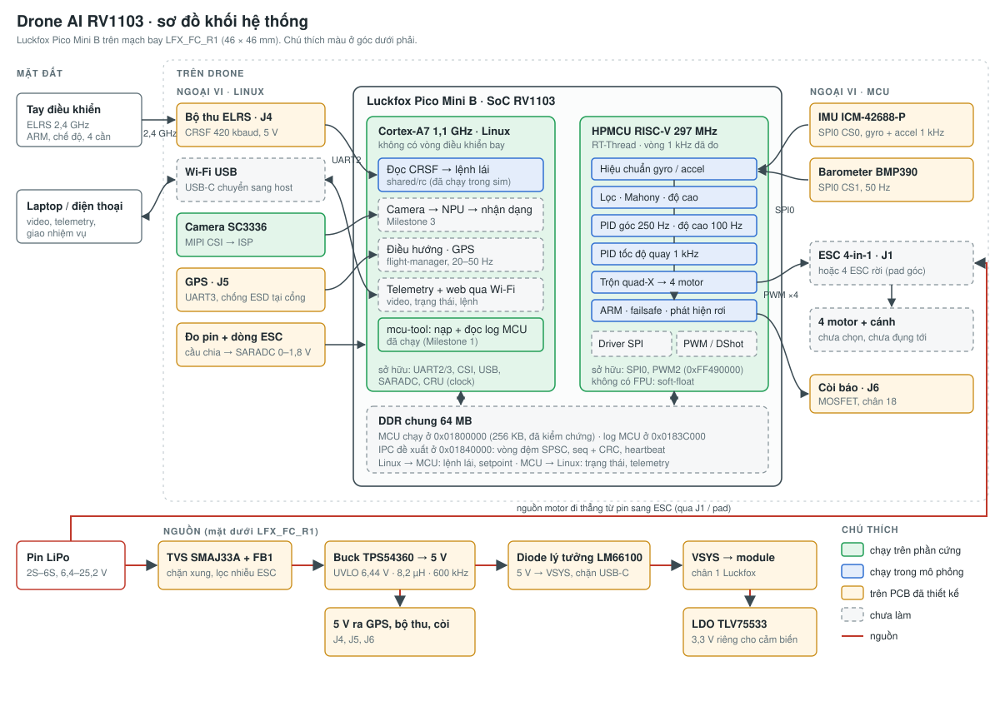

## Mục lục

- [Trạng thái theo mốc](#trạng-thái-theo-mốc)
- [Kiến trúc](#kiến-trúc)
- [Phần cứng: mạch bay LFX_FC_R2](#phần-cứng-mạch-bay-lfx_fc_r2)
- [Mô phỏng](#mô-phỏng)
- [Bắt đầu nhanh](#bắt-đầu-nhanh)
- [Cấu trúc repo](#cấu-trúc-repo)
- [An toàn](#an-toàn)
- [Tài liệu](#tài-liệu)
- [Nguồn tham khảo](#nguồn-tham-khảo)
- [License](#license)

## Trạng thái theo mốc

| Mốc | Nội dung | Kết quả | Bằng chứng |
|---|---|---|---|
| 01 | Điều tra phần cứng RV1103, HPMCU trong SDK | xong | [RV1103_MCU.md](docs/RV1103_MCU.md), [PERIPHERALS.md](docs/PERIPHERALS.md) |
| 02 | Build firmware Luckfox stock trên macOS | **PASS** | `logs/sdk_build.log`, [MILESTONE1.md](docs/MILESTONE1.md) |
| 03 | Build RT-Thread cho HPMCU | **PASS** | [MCU_BUILD.md](docs/MCU_BUILD.md) |
| 04 | MCU chạy song song Linux, vòng 1 kHz | **PASS trên board**: 2 × 1 000 000 vòng, 0 lỡ chu kỳ; jitter 18,2 µs lúc idle, 116,7 µs khi camera chạy | [REALTIME.md](docs/REALTIME.md) |
| — | Mạch bay LFX_FC_R1 (46 × 46 mm, 4 lớp) | thiết kế xong: ERC 0, DRC 0, 0 nối hở, khớp sơ đồ | [phần cứng](#phần-cứng-mạch-bay-lfx_fc_r1) |
| 05 | Phần mềm bay + mô phỏng SITL + 3D | **77/77 unit test, 10/10 kịch bản bay** (×2 profile cảm biến), kiểm thử bàn phím end-to-end 6/6 | [simulator/README.md](simulator/README.md) |
| 05b | Phần mềm bay chạy trên HPMCU với cảm biến giả (đo thời gian) | build xong (53 KB), **chưa chạy**: board chưa cắm | `tools/run_fc_mcu.sh` |
| 06–07 | Driver SPI + ICM-42688-P trên MCU | chưa làm: cần module IMU để kiểm | |
| 11 | Xuất PWM / DShot, đo bằng logic analyzer | chưa làm, **không gắn cánh** | |
| 12–13 | Điều khiển từ xa: IPC Linux ↔ MCU, `rc-bridge` (ELRS + mạng), trạm mặt đất có camera | **code xong, chuỗi đầy đủ chạy trên Mac 7/7**; build cho board xong, **chưa chạy trên board**; bộ thu ELRS cần chuyển console khỏi UART2 | [ground/README.md](ground/README.md) |
| M3 | Camera → NPU → nhận dạng, Wi-Fi, telemetry | chưa làm | |

Kế hoạch đầy đủ theo thứ tự an toàn ở mục [An toàn](#an-toàn).

## Kiến trúc

| Miền | Chạy gì | Sở hữu phần cứng |
|---|---|---|
| **HPMCU** RISC-V SCR1 297 MHz, `rv32imc` (không FPU), RT-Thread | vòng tốc độ quay 1 kHz, vòng góc 250 Hz, vòng độ cao 100 Hz, trộn motor, ARM / failsafe | SPI0 (IMU, barometer), PWM2 kênh 8–11 (4 ESC) |
| **Cortex-A7** 1,1 GHz, Linux (Buildroot của SDK) | đọc bộ thu RC (CRSF), camera + NPU, điều hướng, LTE + GPS (module Lierda), telemetry Wi-Fi, nạp firmware MCU và Lierda | UART2 (bộ thu RC), UART3 (Lierda: AT, GNSS, nạp firmware), chân 18/20 (RESET/BOOT Lierda), MIPI CSI, USB, SARADC, CRU |
| **DDR chung** 64 MB | MCU chạy ở `0x01800000` (256 KB, đã kiểm chứng); IPC đề xuất ở `0x01840000` | [MEMORY_MAP.md](docs/MEMORY_MAP.md) |

Luồng điều khiển:

```
IMU 1 kHz ─► hiệu chuẩn ─► lọc ─► Mahony (góc) + baro/accel (độ cao)
          ─► PID góc / độ cao ─► PID tốc độ quay ─► trộn quad-X ─► 4 motor (0..1)
tay điều khiển ELRS ─► bộ thu (CRSF 420 kbaud) ─► Linux ─► IPC ─► MCU (lệnh lái, ARM, chế độ)
```

Code bay (`mcu/`) là C99 thuần, chỉ dùng float, không cấp phát động. Cùng một mã nguồn build cho:
- máy Mac (mô phỏng);
- MCU (RT-Thread).

Chỗ đổi duy nhất là nguồn dữ liệu cảm biến:
- `SIM_SENSOR`: cảm biến giả trong mô phỏng;
- `REAL_SENSOR`: driver thật (bước 06–07).

Chi tiết và rủi ro: [ARCHITECTURE.md](docs/ARCHITECTURE.md), [architecture.html](docs/architecture.html).

**Rủi ro lớn nhất của kiến trúc một chip:**

| Rủi ro | Hệ quả |
|---|---|
| HPMCU không có FPU | code bay chạy bằng soft-float; phải đo thời gian thật |
| HAL MCU của RV1106 không có SPI và UART | phải tự viết driver |
| Tải camera làm jitter MCU tăng 6,4 lần | ảnh hưởng độ ổn định vòng điều khiển |
| Tín hiệu RC đi qua Linux | Linux treo là mất RC; MCU phải tự vào failsafe |

## Phần cứng: mạch bay LFX_FC_R2

**Một board 50 × 50 mm** gồm mạch bay cho Luckfox Pico Mini B và module **LTE Cat.1 bis + GNSS** (Lierda NT26-KCN E, khay nano-SIM, 2 cổng U.FL). Thiết kế bằng pipeline KiCad 10 viết bằng script, trong [`hardware/LFX_FC_R2/`](hardware/LFX_FC_R2): `design.py` → sơ đồ → PCB → file sản xuất.

| Mặt trên | Mặt dưới | 3D |
|---|---|---|
| 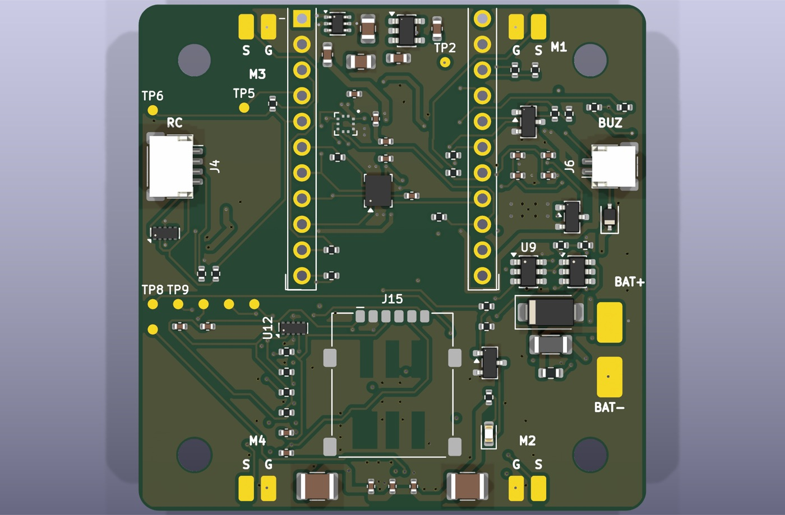 | 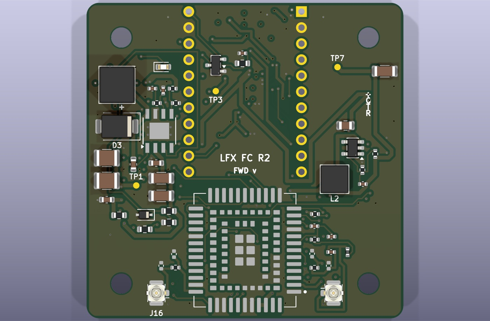 | 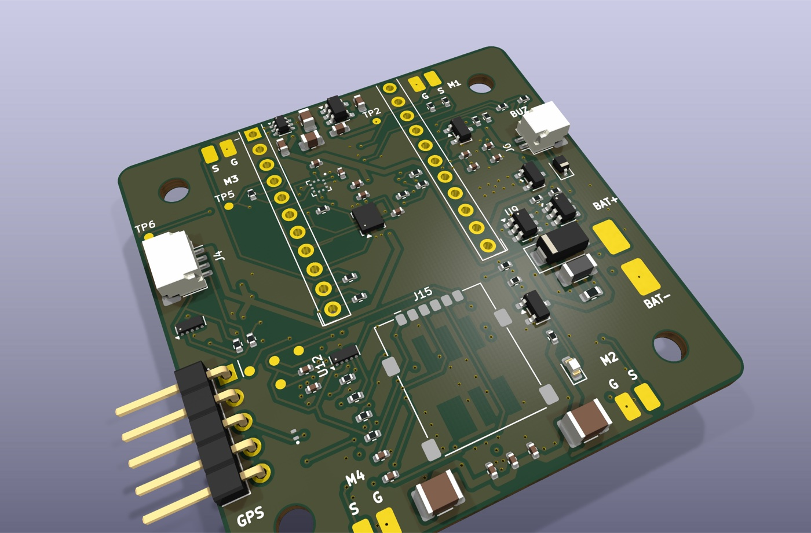 |

Module Lierda và đế cắm Luckfox chưa có mô hình 3D trong KiCad nên trên ảnh render chỉ thấy pad của chúng.

**Thông số:**
- **Kích thước:** 50 × 50 mm, 4 lớp: F.Cu tín hiệu / GND / VSYS (+ đảo 3,3 V cảm biến, đảo 3,8 V dưới module LTE, đảo GND dưới đường anten) / B.Cu.
- **Lỗ bắt vít:** 4 lỗ M3, khoảng cách lỗ **39 × 39 mm**, cách mép 5,5 mm.
- **Nguồn vào:** pin 2S–6S, hàn vào pad BAT+ / BAT− (mặt trên, phía trước bên phải).
- **Mạch nguồn:**
  - TVS SMAJ33A và ferrite chặn xung, lọc nhiễu.
  - Buck TPS54360 ra 5 V (theo thiết kế mẫu TI SLVSBB4G), ngưỡng UVLO 6,44 V. Đặt ở mặt dưới dải phải, cách IMU khoảng 15 mm, có lớp GND In1 ở giữa.
  - Diode lý tưởng LM66100 cấp VSYS cho Luckfox; LDO TLV75533 cấp 3,3 V riêng cho cảm biến.
  - Buck TLV62569 hạ +5 V xuống **3,8 V** cho module LTE. VBAT của module chỉ chịu 3,3–4,5 V, nên không lấy thẳng từ pin.
- **Cảm biến trên SPI0:** IMU ICM-42688-P và barometer BMP390, đặt dưới Luckfox; 4 đường SPI của IMU vẽ tay, không dùng via.
- **Motor:** 4 cặp pad S/G ở 4 góc cho **4 ESC rời** (PWM8–11, điện trở 47 Ω). Không còn cổng ESC 4-in-1.
- **LTE + GNSS: Lierda NT26-KCN E** ở mặt dưới, nửa trước. Khi đặt mua chọn bản **GPS + BDS**: bản NT26KCNE20GNB trong sổ tay phần cứng chỉ có BeiDou, chân ra giống hệt.
  - UART3 của Luckfox (chân 12/13) đi qua 2 con SN74LVC1T45 để chuyển 3,3 V ↔ 1,8 V. Chip này tự cách ly khi module tắt, vì UART của module không chịu điện áp ngược. Cùng một UART dùng cho lệnh AT, đọc GNSS và nạp firmware (921600 bd).
  - **Luckfox nạp firmware cho Lierda:** chân 18 kéo RESET_N qua MOSFET; chân 20 (GPIO4_C1, bank 1,8 V, cùng mức với module) nối USB_BOOT qua 1 kΩ. Giữ BOOT mức cao rồi reset ≥ 300 ms là module vào chế độ nạp. Có test pad USB (D+/D−/VBUS) để nạp cứu bằng máy tính.
  - Khay **nano-SIM** có nắp bản lề ở mặt trên, giữa phía trước; điện trở 22 Ω, tụ 33 pF, chống ESD TPD4E05U06.
  - 2 cổng U.FL ở 2 góc trước mặt dưới: GNSS bên trái, LTE bên phải. Đường 50 Ω rộng 0,35 mm trên B.Cu, có mạch π để chỉnh phối hợp trở kháng. GNSS cấp nguồn 3,3 V cho anten active; dùng anten thụ động thì bỏ R43.
  - Còi được điều khiển từ chân AGPIO5 (pad 97, ở mép module) của Lierda, vì Luckfox đã hết chân.
  - **Không bật chế độ ngủ của module** (`AT+QSCLK=1`): khi ngủ, VDD_EXT tắt nên bộ chuyển mức cách ly, Luckfox không đánh thức được qua UART.

**Đầu cắm và pad:**

| Cổng | Chân | Ghi chú |
|---|---|---|
| J2 / J3 · pad pin | BAT+ / BAT− | dây XT30 từ pin, cùng dây cấp cho 4 ESC |
| J4 · bộ thu RC ELRS | 1 5 V, 2 GND, 3 TX board → RX bộ thu, 4 RX board ← TX bộ thu | UART2, CRSF; R24 1 kΩ kéo lên để bộ thu không kẹt bootloader |
| J6 · còi | 1 +5 V, 2 còi − (MOSFET đóng ngắt) | gate do AGPIO5 của Lierda điều khiển |
| J7–J14 · pad ESC | S / G ở 4 góc | M1 sau-phải, M2 trước-phải, M3 sau-trái, M4 trước-trái (Betaflight) |
| J15 · nano-SIM | | GCT SIM8060, nắp bản lề |
| J16 · U.FL LTE / J17 · U.FL GNSS | | mặt dưới, 2 góc trước |
| TP1–TP3, TP5, TP6 | +5 V, VSYS, +3V3S, RC_TX, RC_RX | TP5/TP6: xem console khi rút bộ thu |
| TP7–TP13 | +3V8, VDD_EXT 1,8 V, USB D+, USB D−, USB VBUS, DBG TX, DBG RX của Lierda | nạp cứu / xem log module |

**Kiểm tra:** ERC 0, DRC 0 vi phạm / 0 cảnh báo, 0 nối hở, 0 lỗi khớp sơ đồ (`--schematic-parity`).

**Bộ file sản xuất** (Gerber, khoan, BOM, vị trí linh kiện, STEP) do `make_fab.py` tạo ra `fab/`. Thư mục này không lưu trong git.

**Cần làm trước khi đặt hàng:**
- BOM chưa có mã linh kiện cụ thể (MPN).
- Nên chọn xi **ENIG**: IMU, barometer là chip chân LGA và module Lierda là LCC + LGA 109 chân, cần pad phẳng.

### Lắp drone: khung LFX_FRAME_R1, động cơ không chổi than, 4 ESC rời

| Khung (in 3D) | Lắp đủ: khung + board + vỏ + motor + ESC + pin | Nhìn từ trên |
|---|---|---|
| 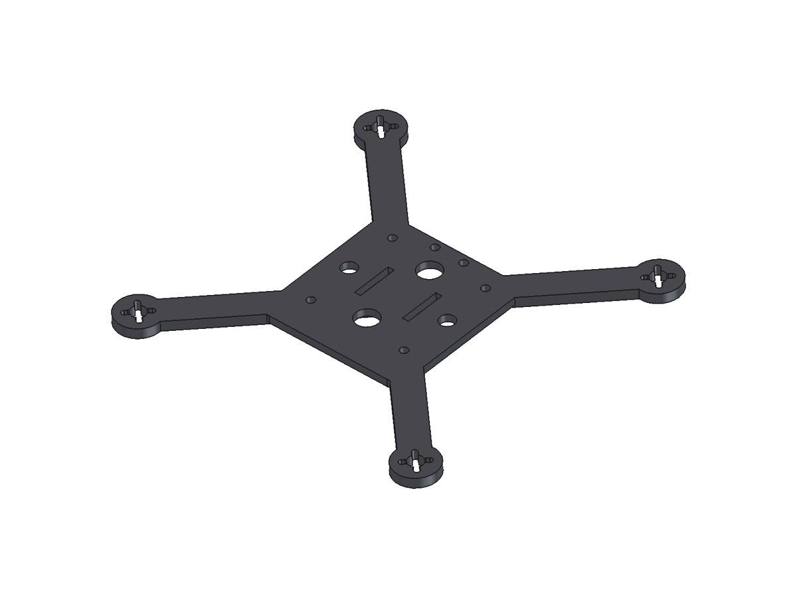 | 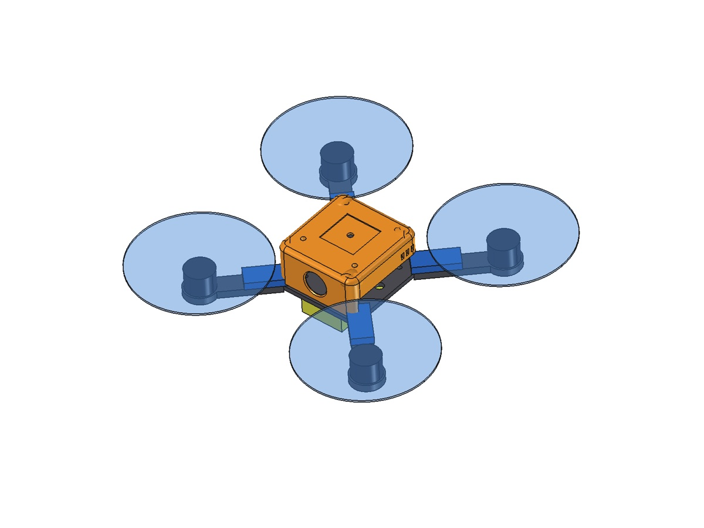 | 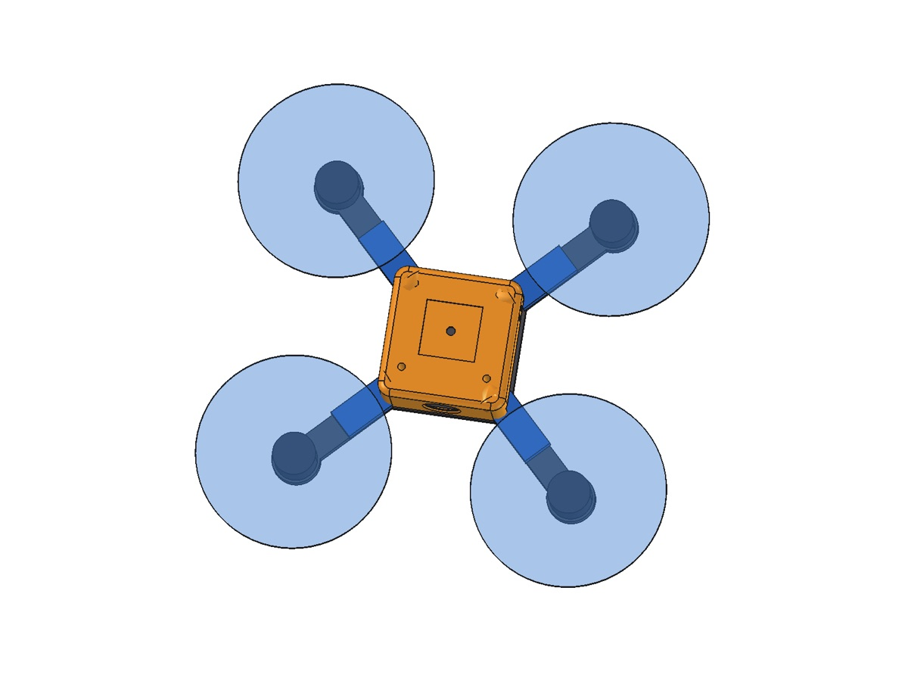 |

**Khung [`hardware/LFX_FRAME_R1`](hardware/LFX_FRAME_R1)** dựng bằng FreeCAD (script tham số `frame_freecad.py`), in 3D:
- Tấm giữa dày 3 mm: board bắt thẳng bằng **4 cột M3 dài 8 mm** vào lỗ 39 × 39, không cần tấm chuyển. Có 2 khe dây buộc pin 15 mm, lỗ khoét giảm nhẹ, 2 lỗ phía sau để buộc ống anten.
- 4 tay đòn dày 4 mm kiểu X. Đế motor có **rãnh M2 hướng tâm** (bán kính 3,3–4,5 mm), lắp được motor 1104 (4 × M2 trên vòng Ø9 mm) và loại 1103 nhỏ hơn.
- **Khoảng cách motor do script tự tìm:** đẩy dần motor ra xa cho tới khi cánh 3" (thêm 2 mm dự phòng) không chạm vỏ canopy. Kết quả: motor cách tâm 58 mm theo mỗi trục (đường chéo trục 164 mm), khung 133 × 133 mm.
- 4 ESC buộc dây rút lên tay đòn, nằm ngoài vỏ; pin buộc dưới tấm giữa.
- In: PETG (hoặc PLA-CF), 5 lớp viền, infill 40 %. Khối lượng đặc khoảng 26 g.

**Linh kiện mua thêm (giá tham khảo):**

| Linh kiện | Gợi ý | Ghi chú |
|---|---|---|
| Motor ×4 | 1103 8000–10000 KV hoặc 1104 7500 KV | 1103 trên 2S: khoảng 145 g lực đẩy/con |
| ESC ×4 | BLHeli_S 12A rời (vd. Makerfire 12A, ~$2,5, 6 g) | EMAX 6A nhẹ hơn, đủ cho 1103 |
| Cánh | 3" (3016/3018) | |
| Pin | LiPo 2S 450–550 mAh, đầu XT30 | |
| Cột M3 | 4 × 8 mm (khung → board) | |
| Anten | LTE dạng dán (FPC) + GNSS 25 × 25 mm (active 3,3 V hoặc thụ động), đầu U.FL | anten GNSS đặt trong hốc trên nóc vỏ |

**Đấu nối:**
```
Pin 2S ─ XT30 ─┬─ nguồn 4 ESC (đỏ / đen)
               └─ BAT+ / BAT− (J2 / J3) trên board
ESC n: tín hiệu → pad S, mass tín hiệu → pad G ở góc của motor n
   M1 sau-phải J7/J11 · M2 trước-phải J8/J12 · M3 sau-trái J9/J13 · M4 trước-trái J10/J14
Motor: 3 dây vào ESC; quay ngược chiều thì đổi 2 dây bất kỳ
```
- Buck 5 V khởi động từ 6,44 V và tự ngắt ở 5,83 V (khoảng 2,9 V/cell), nên dùng pin 2S đã nạp đầy.
- ESC rời không có chân báo dòng, nên chỉ đo được áp pin (ADC_VBAT), không đo được dòng.

**Trọng lượng ước tính** (chưa cân thực tế):
- Board R2 khoảng 16 g, Luckfox + camera khoảng 8 g, 4 ESC khoảng 24 g, 4 motor 1104 khoảng 24 g, khung khoảng 26 g, vỏ khoảng 13 g, cánh khoảng 4 g, pin khoảng 30 g, anten + ốc + dây khoảng 8 g.
- Tổng **khoảng 153 g**. 4 motor 1103 cho khoảng 580 g lực đẩy, tức **tỉ lệ khoảng 3,8:1**: dư lực, bay ổn định.

### Vỏ in 3D: LFX_CANOPY_R1

| Vỏ | Nhìn xuyên (kiểm tra lắp) | Phía sau |
|---|---|---|
| 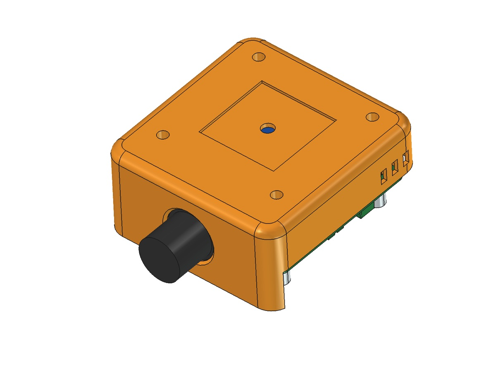 | 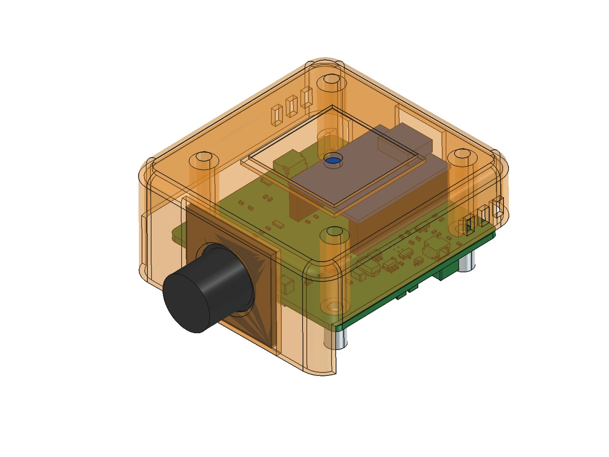 | 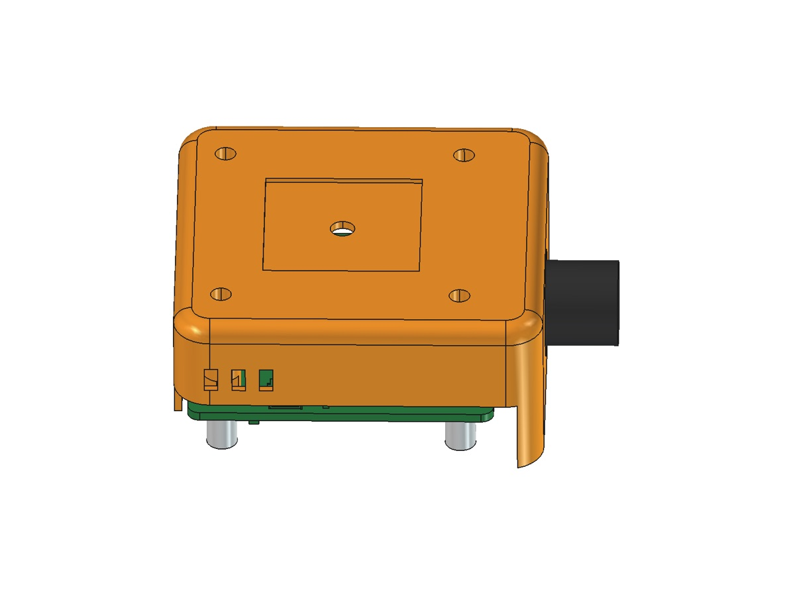 |

Vỏ che board, dựng bằng **FreeCAD 1.1** (script tham số [`canopy_freecad.py`](hardware/LFX_CANOPY_R1/canopy_freecad.py), chạy trong FreeCAD hoặc qua addon [freecad-mcp](https://github.com/neka-nat/freecad-mcp)). Script dựng cả cụm lắp ráp từ file STEP của board (KiCad) cộng khối đại diện cho Luckfox, camera, Lierda, cột đỡ, rồi **kiểm tra va chạm**: không chạm.

- File in: [`canopy.stl`](hardware/LFX_CANOPY_R1/canopy.stl) (và `canopy.step`), 58 × 60 × 29 mm, khoảng 13 g PETG.
- Thành 1,2 mm (3 lớp viền với đầu phun 0,4 mm), bo tròn mọi cạnh, lỗ ống kính vát mép.
- Camera SC3336 áp vào mặt trong thành trước, có gờ định vị 4 phía; cố định bằng băng dính 2 mặt hoặc keo nến.
- Lỗ USB-C phía sau, nên **vẫn cắm cáp nạp code cho Luckfox khi đã đậy vỏ**.
- Hai bên hông để trống phía dưới cho dây RC, còi, ESC, dây pin và cáp U.FL; khe thông gió ngay trên Luckfox.
- Trên nóc có hốc lõm 0,8 mm đặt anten GNSS loại 25 × 25 mm (nằm trên cùng, nhìn thẳng lên trời) và lỗ luồn cáp; mặt nóc vẫn phẳng để in úp.
- 4 trụ rỗng tì xuống board tại 4 lỗ 39 × 39; vít **M3 × 25** xuyên trụ, qua board, vào cột đỡ.
- In: úp nóc xuống bàn in, PETG, không cần support.
- Sửa kích thước: đổi tham số đầu file `canopy_freecad.py` rồi chạy lại trong FreeCAD. File STEP của board xuất bằng `kicad-cli pcb export step` vào `hardware/LFX_CANOPY_R1/step/`.

### Phiên bản cũ

Vẫn giữ trong repo, DRC sạch, nhưng không còn là thiết kế chính:
- [`LFX_FC_R1`](hardware/LFX_FC_R1): mạch bay 46 × 46 mm, cổng ESC 4-in-1 (J1), cổng J5 nối sang board LTE ([ảnh](docs/img/pcb/3d_iso.jpg)).
- [`LFX_LTE_R1`](hardware/LFX_LTE_R1): board LTE 46 × 46 mm xếp tầng trên R1 ([ảnh](docs/img/pcb/lte_3d_iso.jpg)).
- [`LFX_MOUNT_R1`](hardware/LFX_MOUNT_R1): tấm chuyển lỗ 39 × 39 → khung 20 × 20 / 25,5 × 25,5 mm, dùng khi lắp board lên khung mua sẵn thay cho LFX_FRAME_R1 ([ảnh](docs/img/pcb/mount_3d_iso.jpg)).

## Mô phỏng

Toàn bộ phần mềm bay chạy trên máy Mac, lái được bằng bàn phím hoặc tay điều khiển USB. Tín hiệu điều khiển đi qua đúng đường mà bộ thu thật sẽ đi: khung CRSF → bộ đọc CRSF → `fc_tick()`. Chi tiết: [simulator/README.md](simulator/README.md).

| | |
|---|---|
| 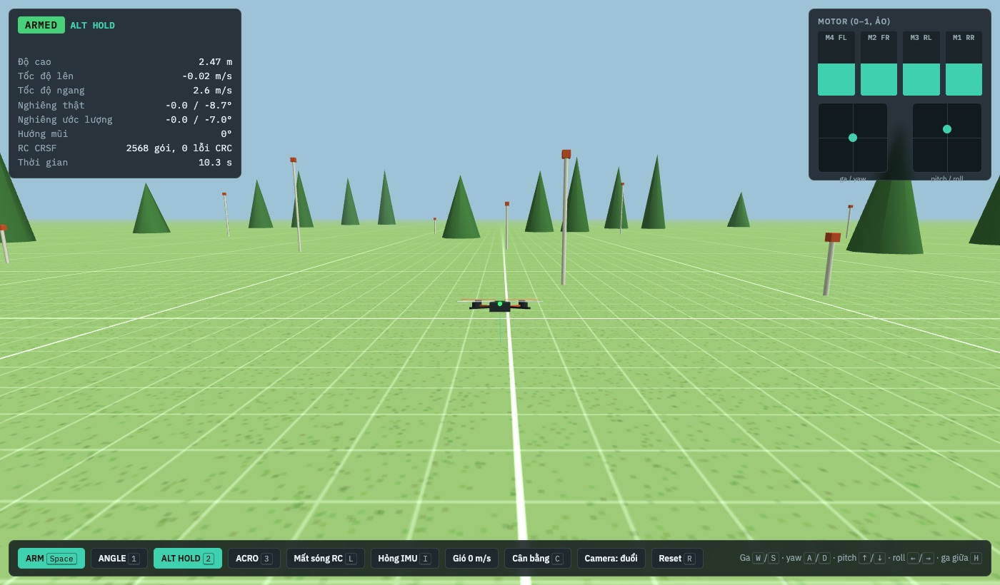 **ALT HOLD**, camera đuổi theo | 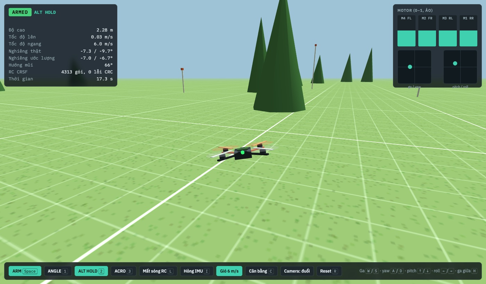 Vòng trong gió 6 m/s |
| 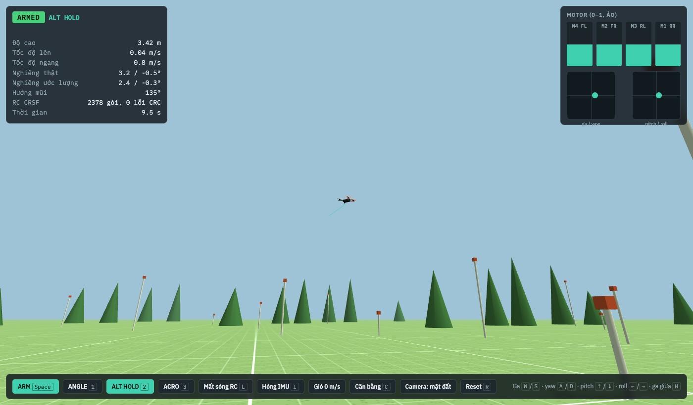 Người lái đứng dưới đất | 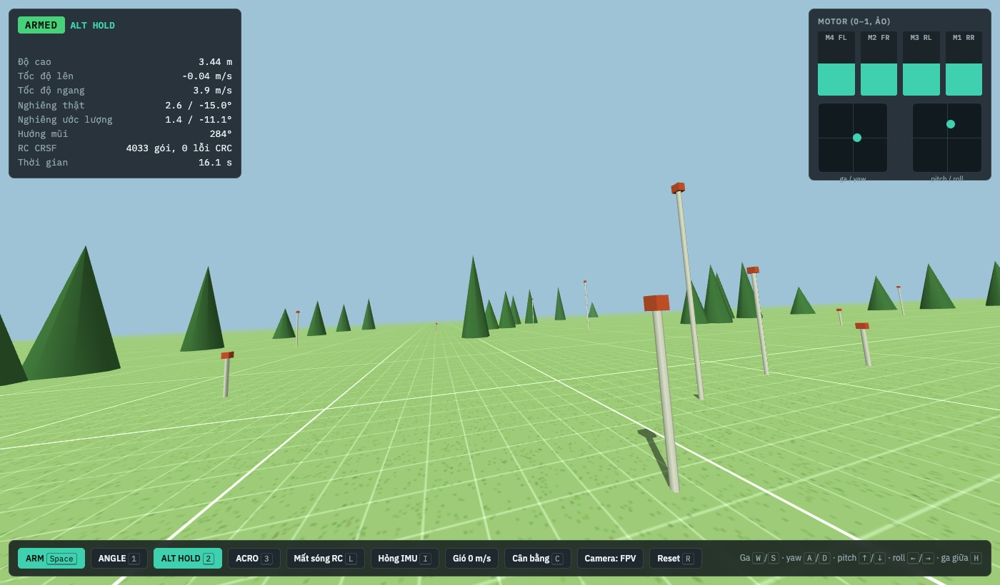 Camera FPV |
| 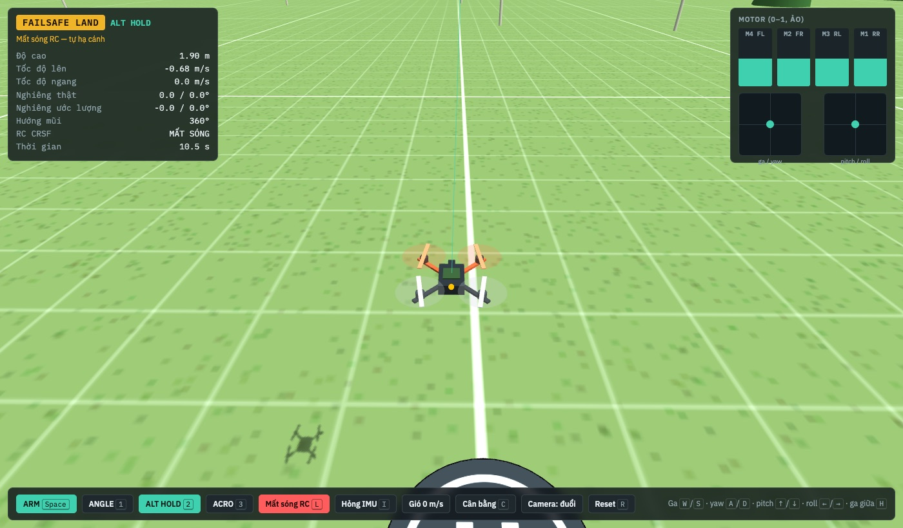 **Mất sóng RC** → tự hạ cánh | 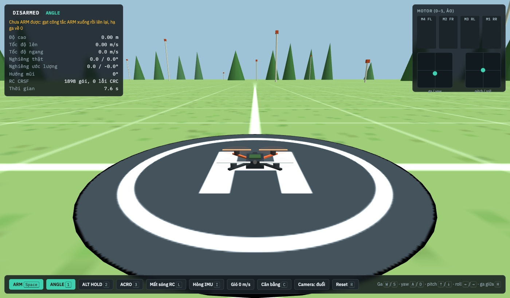 **Từ chối ARM** khi ga chưa về 0 |

Dữ liệu từ chính các kịch bản kiểm thử (`tools/plot_sim.py`):

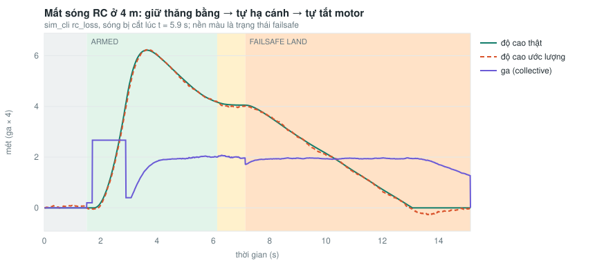

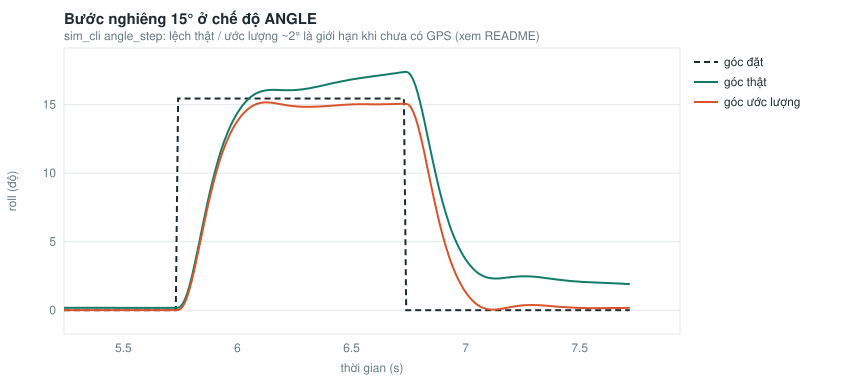

**Kết quả kiểm thử** (`make -C simulator test`):

| Kịch bản | Kết quả |
|---|---|
| giữ độ cao 10 s | sai số tối đa 0,25 m, nghiêng 0,2°, ước lượng góc sai 0,09° rms |
| bước nghiêng 15° | đạt 90 % trong 0,27 s, vọt lố 12 % |
| mất sóng RC ở 4 m | giữ thăng bằng sau 0,26 s, tự hạ sau 1,26 s, chạm đất và tự tắt motor, không rơi |
| IMU hỏng giữa trời | tắt motor sau 20 ms |
| gió 4,5 m/s + giật 2 m/s | độ cao sai < 0,3 m, nghiêng < 4° |
| lật 360° ở ACRO | đạt 418 °/s (yêu cầu 400), tự cân bằng lại, ước lượng góc vẫn đúng |
| bật ALT HOLD khi đang lên 9 m/s | phanh rồi khóa độ cao, sau 3 s lệch < 0,2 m |

**Giới hạn đã biết:**
- **Khung drone là giả định** (0,6 kg, 225 mm, 6 N/motor). Các hệ số PID chỉ là điểm xuất phát.
- **Chưa có GPS nên không giữ được vị trí.** Khi drone tăng tốc hoặc vào cua, góc ước lượng lệch 2–5°, vì accelerometer không phân biệt được nghiêng với gia tốc.
- **Thời gian chạy đo trên Mac không đại diện cho MCU.** Phải đo trên board.

## Điều khiển từ xa và camera

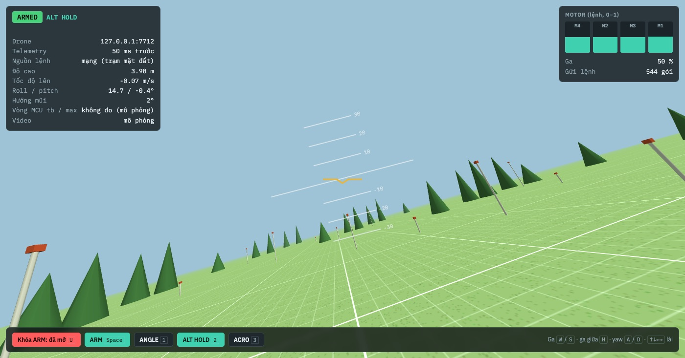

Trạm mặt đất trên Mac: video camera, đường chân trời nhân tạo, telemetry, lái bằng bàn phím hoặc tay điều khiển USB.
Lệnh đi qua UDP tới `rc-bridge` trên Linux của drone, rồi qua RAM chung tới code bay trên MCU. Bộ thu ELRS (nếu có)
luôn được ưu tiên. Camera là `rkipc` sẵn có (RTSP `/live/1`, H.265 704×576). Chi tiết, an toàn, giới hạn:
[ground/README.md](ground/README.md).

## Bắt đầu nhanh

Máy phát triển: macOS (Apple Silicon), Docker qua OrbStack, `adb`, KiCad 10 (chỉ cần cho phần cứng).

**Mô phỏng** (chỉ cần `cc` và `python3`):

```sh
make -C simulator test       # unit test + kịch bản bay
make -C simulator run        # rồi mở http://127.0.0.1:8777
```

Lái thử: `C` hiệu chuẩn → `Space` ARM → giữ `W` cho cất cánh → `2` giữ độ cao → `H` ga giữa → phím mũi tên để lái.
Hạ cánh: vẫn ở `2` (ALT HOLD), giữ `S` (xuống tối đa 1 m/s), chạm đất thì `Space`. Hạ ga về 0 ở chế độ `1` là rơi tự do. Drone rơi thì bấm `R`.
Thử lỗi: `L` cắt sóng RC, `I` hỏng IMU, `G` gió.
Tay điều khiển EdgeTX/ELRS cắm USB (chế độ joystick) được nhận tự động.

**Source SDK (Linux kernel, U-Boot, Buildroot, RT-Thread):** 14 GB, nằm trong Docker volume `luckfox-src`
(ổ ảo của OrbStack phân biệt hoa/thường, ổ SSD thì không). `sdk/` trong repo là symlink tới đó, chỉ mở
được khi Docker engine đang chạy (`orb start`), và không nằm trong git:

```sh
ln -s ~/OrbStack/docker/volumes/luckfox-src/luckfox-pico sdk   # tạo lại nếu thiếu
ls sdk/sysdrv/source/          # kernel  uboot  buildroot  mcu
```

**Firmware Luckfox (Linux):**

```sh
./run.sh build               # build SDK trong Docker (volume luckfox-src), ảnh ra images/
./run.sh flash               # nạp qua ADB
./run.sh connect             # SSH root@172.32.0.93 qua USB-ECM
```

**Firmware MCU:**

```sh
tools/build_mcu.sh luckfox_mini-M1-NONE   # Milestone 1: vòng 1 kHz đo jitter
tools/build_mcu.sh luckfox_mini-FC-NONE   # phần mềm bay + cảm biến giả trên MCU
tools/build_linux_tools.sh                # mcu-tool (nạp / log / dừng MCU từ Linux)
tools/run_fc_mcu.sh 60                    # nạp lên board, chạy 60 s, lưu log vào logs/
```

`run_fc_mcu.sh` tự kiểm tra vùng nhớ MCU (reserved-memory `mcu@1800000`) trước khi nạp. Sai thì dừng, không nạp. Quy trình chi tiết: [MILESTONE1.md](docs/MILESTONE1.md), [MCU_BUILD.md](docs/MCU_BUILD.md).

**Mạch bay** (KiCad 10; `KP` = python đi kèm KiCad):

```sh
hardware/fetch_vendor.sh            # STEP + sơ đồ Luckfox + datasheet (không lưu trong repo)
cd hardware/LFX_FC_R1
KP=/Applications/KiCad/KiCad.app/Contents/Frameworks/Python.framework/Versions/3.9/bin/python3.9
export FREEROUTING_JAR=$HOME/freerouting-1.9.0.jar
python3 scripts/gen_lib.py && python3 scripts/gen_sch.py          # thư viện + sơ đồ nguyên lý
$KP scripts/gen_pcb.py && $KP scripts/route_critical.py           # đặt linh kiện, đi dây quan trọng
FR_ATTEMPTS=3 $KP scripts/route_pcb.py && $KP scripts/route_maze.py && $KP scripts/clean_stubs.py
python3 scripts/make_fab.py && python3 scripts/make_images.py     # file sản xuất, DRC, ERC, ảnh
```

Nguồn gốc duy nhất của mạch là `scripts/design.py`. Không sửa tay file `.kicad_sch` / `.kicad_pcb`.

**Ảnh cho README:** `tools/sim_screenshots.sh` (cần Google Chrome) và `python3 tools/plot_sim.py`.

## Cấu trúc repo

```
docs/                 kiến trúc, bằng chứng phần cứng, bản đồ bộ nhớ, kết quả đo, ảnh
hardware/LFX_FC_R2/   mạch bay + LTE/GNSS trên 1 board: scripts/ (design.py → sơ đồ → PCB → file sản xuất), sch/
hardware/LFX_FRAME_R1/   khung in 3D (FreeCAD: frame_freecad.py → frame.stl / .step)
hardware/LFX_CANOPY_R1/  vỏ in 3D (FreeCAD: canopy_freecad.py → canopy.stl / .step)
hardware/LFX_FC_R1/   bản cũ 46 × 46 mm; lib/ là thư viện symbol / footprint LFX dùng chung
hardware/LFX_LTE_R1/, LFX_MOUNT_R1/   bản cũ: board LTE xếp tầng, tấm chuyển lỗ bắt vít
hardware/datasheets/  danh sách datasheet và link chính thức (PDF tải bằng hardware/fetch_vendor.sh)
mcu/
  common/             toán vector / quaternion (float)
  sensors/            giao diện cảm biến, bộ lọc, hiệu chuẩn gyro
  estimator/          Mahony, ước lượng độ cao
  control/            PID, bộ điều khiển tầng
  mixer/              trộn quad-X
  failsafe/           ARM, failsafe, phát hiện rơi
  fc/                 fc_step() / fc_tick(), tham số mặc định
  link/               nhận lệnh / gửi telemetry qua IPC
  tests/              unit test
  bsp/                board RT-Thread: M1 (đo 1 kHz), FC (phần mềm bay trên MCU)
shared/
  ipc/                layout bộ nhớ chung MCU ↔ Linux, vòng đệm fc_ipc
  rc/                 CRSF, ánh xạ kênh RC
simulator/            mô hình quad, cảm biến giả, kịch bản, server + trang 3D
linux/                phía Linux: mcu-tool (nạp / log / dừng MCU), rc-bridge (điều khiển từ xa), DTS
ground/               trạm mặt đất: gcs.py + trang web (video, telemetry, lái), kiểm thử cả chuỗi
tools/                script build / nạp / chụp ảnh
run.sh                build → flash → connect firmware Luckfox
sdk -> ~/OrbStack/…   symlink tới SDK Luckfox trong Docker volume (không vào git)
```

## An toàn

Thứ tự phát triển bắt buộc (plan mục 29), không bỏ bước:

1. mô phỏng phần mềm ✅
2. mô phỏng trên MCU (đã build, chờ chạy)
3. IMU trên bàn
4. PWM, đo bằng logic analyzer
5. ESC không cánh
6. motor không cánh
7. buộc dây thử có kiểm soát
8. mới tính tới bay

Quy tắc trong code:
- Luôn khởi động ở **DISARMED**. Không bao giờ tự ARM.
- Muốn ARM phải: gạt công tắc xuống rồi lên lại, ga ở mức 0, còn sóng RC, IMU sống, đã hiệu chuẩn, drone đang nằm thẳng.
- Mất sóng: giữ thăng bằng 1 s, rồi tự hạ cánh, rồi tự tắt motor. Mất IMU: tắt motor ngay.

Quy tắc làm việc:
- **Không đụng ESC hay motor khi chưa có sự đồng ý rõ ràng.**
- Mọi số liệu phải ghi nguồn (file, dòng, datasheet, log). Chưa kiểm chứng thì ghi `UNKNOWN — NEED VERIFICATION`.

## Tài liệu

| File | Nội dung |
|---|---|
| [ARCHITECTURE.md](docs/ARCHITECTURE.md) · [architecture.html](docs/architecture.html) | phần cứng đã xác minh, chia việc Linux / MCU, rủi ro, phương án B |
| [RV1103_MCU.md](docs/RV1103_MCU.md) | bằng chứng về HPMCU từ SDK |
| [PERIPHERALS.md](docs/PERIPHERALS.md) | ngoại vi, sơ đồ chân, bộ thu RC trên UART2 |
| [MEMORY_MAP.md](docs/MEMORY_MAP.md) | vùng nhớ MCU, log, IPC |
| [IPC.md](docs/IPC.md) | trao đổi Linux ↔ MCU |
| [REALTIME.md](docs/REALTIME.md) | kết quả đo vòng 1 kHz |
| [MILESTONE1.md](docs/MILESTONE1.md) | quy trình build / nạp / kiểm tra Milestone 1 |
| [MCU_BUILD.md](docs/MCU_BUILD.md) | build firmware MCU |
| [simulator/README.md](simulator/README.md) | mô phỏng: điều khiển, kịch bản, nguồn số liệu, giới hạn |

## Nguồn tham khảo

- SDK Luckfox: [LuckfoxTECH/luckfox-pico](https://github.com/LuckfoxTECH/luckfox-pico) @ `824b817f`
- Datasheet (không lưu trong repo, tải bằng `hardware/fetch_vendor.sh`, nguồn ở [hardware/datasheets/README.md](hardware/datasheets/README.md)): ICM-42688-P DS-000347 v1.7, BMP390, TPS54360 (SLVSBB4G), LM66100, TLV755P
- CRSF: [tbs-fpv/tbs-crsf-spec](https://github.com/tbs-fpv/tbs-crsf-spec/blob/main/crsf.md) · ExpressLRS: [Receiver Wiring](https://www.expresslrs.org/quick-start/receivers/wiring-up/) · [betaflight#12398](https://github.com/betaflight/betaflight/issues/12398)
- Mahony, Hamel, Pflimlin, *Nonlinear Complementary Filters on the Special Orthogonal Group*, IEEE TAC 2008 · [ahrs docs](https://ahrs.readthedocs.io/en/latest/filters/mahony.html)
- Động học quadcopter: [Gibiansky](https://andrew.gibiansky.com/blog/physics/quadcopter-dynamics/) · [PX4 SITL motor model](https://github.com/PX4/sitl_gazebo/issues/110) · Faessler, Franchi, Scaramuzza, *Differential Flatness of Quadrotor Dynamics Subject to Rotor Drag*, RA-L 2018

## License

| Phần | License |
|---|---|
| Phần mềm: `mcu/`, `shared/`, `simulator/`, `linux/`, `tools/`, `run.sh`, tài liệu | [MIT](LICENSE) |
| Thiết kế phần cứng: `hardware/` (sơ đồ, PCB, thư viện LFX, script sinh mạch) | [CERN-OHL-P v2](hardware/LICENSE) |

Ngoại lệ: file mang header bản quyền riêng giữ nguyên license của chúng.
- `mcu/bsp/*/board.h`, `iomux.h`: Rockchip, Apache-2.0.
- `linux/dts/*.dts`: dựa trên DTS của Luckfox, GPL-2.0+ OR MIT.

SDK Luckfox / Rockchip, datasheet và tài liệu của Luckfox **không** nằm trong repo; tải từ nguồn chính thức.

Dự án thử nghiệm, **không có bảo đảm**. Drone có cánh quay là thiết bị nguy hiểm: làm theo đúng thứ tự ở mục [An toàn](#an-toàn).

